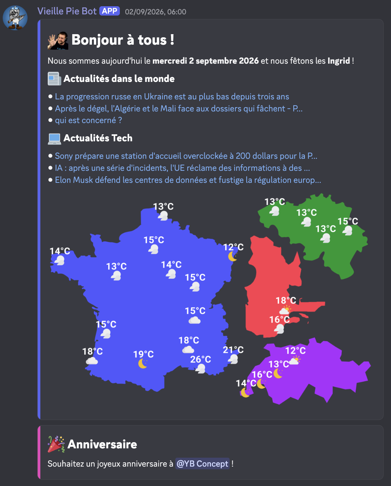

# 🤖 VieillePieBot

Bot Discord privé réalisé pour le serveur Discord **Les Vieilles Pies** envoyant un message chaque matin à 6h avec les informations du jour concernant :
- Les actualités technologiques et dans le monde
- Les fêtes et anniversaires
- La météo en France, Suisse, Belgique et Québec.

## 🔑 Prérequis

- [Docker](https://www.docker.com/)
- [Node.js 22](https://nodejs.org/en)

## 🔧 Installation

1. Cloner le dépôt : `git clone https://github.com/ErwanGit/VieillePieBot`

2. Copier le fichier [`.env.example`](https://github.com/ErwanGit/VieillePieBot/blob/main/.env.example) et complétez les variables d'environnement
    - `TOKEN` / `DEV_TOKEN` : Le token de l'application Discord (obtenable dans [le portail développeurs de Discord](https://discord.com/developers/home) 
    - `GNEWS_TOKEN` : Clé API de [GNews.io](https://gnews.io/)
    - `WEATHER_TOKEN` : Clé API d'[OpenWeatherMap](https://openweathermap.org/)
    - `GUILD_ID` : L'identifiant du serveur Discord sur lequel sera envoyé le message
    - `MSG_TODAY_CHANNEL` : L'identifiant du salon sur lequel sera envoyé le message
    - `BIRTHDAY_ROLE` : L'identifiant du rôle d'anniversaires du serveur 

3. Installer les dépendances : `npm install`

4. Démarrer le bot
    - Mode développement (redémarrage à chaque modification) : `npm run dev:build && npm run dev`
    - Mode production : `npm run build && npm run start`

5. Arrêter le bot au besoin
    - Mode développement (redémarrage à chaque modification) : `npm run dev:down`
    - Mode production : `npm run down`

## ℹ️ Crédits

- Icônes : [Flaticon](https://www.flaticon.com/fr/)
- Données Météos : [OpenWeatherMap](https://openweathermap.org/)
- Actualités : [GNews.io](https://gnews.io/)
